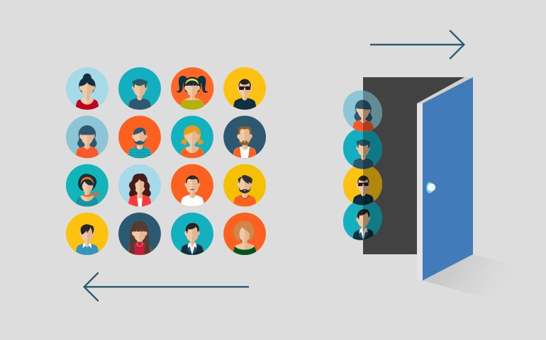

# Telecom-Customer-churn-rate-prediction

# Prediction of Churn rate of the Customers of Telecom company using Machine Learning Algorithms!
## Business Context :

_This case requires trainees to develop a model for predicting customer churn at a fictitious wireless
telecom company and use insights from the model to develop an incentive plan for enticing would-be
churners to remain with company. Data for the case are available in csv format. The data are a scaled
down version of the full database generously donated by an anonymous wireless telephone
company. There are still 7043 customers in the database, and 20 potential predictors._

_Candidates can use whatever method they wish to develop their machine learning model. The data
are available in one data file with 7043 rows that combines the calibration and validation customers.
“Calibration” database consisting of 4000 customers and a “validation” database consisting of 3043
customers. Each database contained (1) a “churn” variable signifying whether the customer had left
the company two months after observation, and (2) a set of 20 potential predictor variables that could
be used in a predictive churn model._

_Following usual model development procedures, the model would be estimated on the calibration
data and tested on the validation data. This case requires both statistical analysis and
creativity/judgment. I recommend you spend much time on both fine-tuning and interpreting results
of your machine learning model._

## _What i have done in this project -_
- Data cleaning including missing values, outliers and multi-collinearity.
- Describing my predictive churn model in elaboration.
- selecting variables to be included in the model.
- Demonstrating the performance of the model by using best set of tools.
- Making sure of the key factors that predict customer churn
- And try to figure out about if these factors make sense
- What kind of offers should be avail to customers to encourage them to remain with company?
- And at last, after the actions have been implemented,determining if they work?

## Now, Key points to look for -

- Collected the data and organized to form a meaningful dataset.
- Checked for null values and observed the data to form meaningful insights.
- Did Exploratory Data Analysis on the dataset.
- Visualizations were made by using Matplotlib and Seaborn Libraries..

## Now, for making model -
- Did Data Preprocessing.
- Finded correlation and plotted a heatmap
- Used One-Hot Encoding for conversion of categorical data to Numerical data.
- Did Train-Test split

## Trained my model using -

### Logistic Regression
_Logistic regression is one of the most commonly used machine learning algorithms for binary classification problems. Logistic regression is a statistical analysis method used to predict a data value based on prior observations of a data set. The purpose of logistic regression is to estimate the probabilities of events, including determining a relationship between features and the probabilities of particular outcomes. The approach allows an algorithm being used in a machine learning application to classify incoming data based on historical data. As more relevant data comes in, the algorithm should get better at predicting classifications within data sets.
A logistic regression model predicts a dependent data variable by analyzing the relationship between one or more existing independent variables._

- Predicted for the data
- Finded Accuracy score
- Plotted Confusion Matrix
- Also plotted the Key factors which predicted customer Churn in LOGISTIC REGRESSION 
- And at last, the Classification report.

## Random Forest Classifier
_Random forest is a flexible, easy to use machine learning algorithm that produces, even without hyper-parameter tuning, a great result most of the time. It is also one of the most used algorithms, because of its simplicity and diversity and this is why i am considering this Algorithm for this Business Context.
Random forest is a supervised learning algorithm. The "forest" it builds, is an ensemble of decision trees, usually trained with the bragging method. The general idea of the bagging method is that a combination of learning models increases the overall result.
random forest just builds multiple decision trees and merges them together to get a more accurate and stable prediction._

- Predicted for the data
- Finded Accuracy score
- Plotted Confusion Matrix
- Also plotted the Key factors which predicted customer Churn in Random Forest Classifier
- And at last, Classification report.

## And CONCLUSION -
### For Determining the work:
I am pretty sure that the given above models with accuracy score more than 80% , these two would be able to determine the prediction if we give the required inputs, model can successfuly give out the adequate output prediction.

Or we can just save the model and make this project an EndToEnd, that will also do.

### The various kind of offers should be avail to customers to encourage them to remain with the Company:

From The Analysis and Prediction done above, i can now Conclude that :
### For eliminating customer churn,
- Firstly, The company should be knowing the customer needs and that's what this project of mine focused on.
- By identifying the Customers who are at the verge of Churning, company should work for improving their satisfaction to make them stay.
- Building Customer Loyality and Improving Customer care services would be also a great thing to do!
- and some perspective changes would be appreciated.

